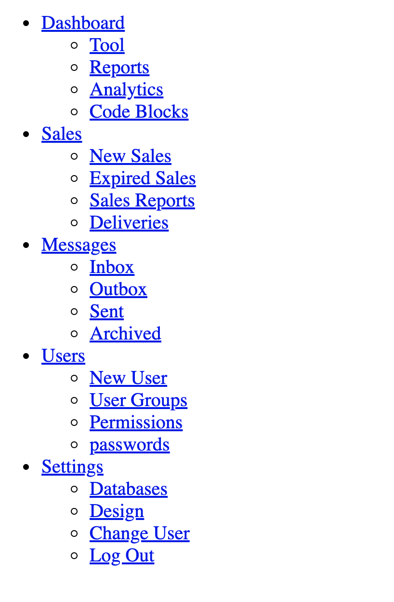
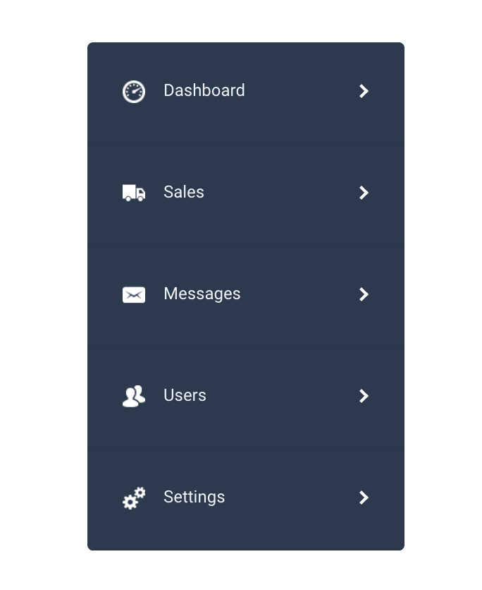
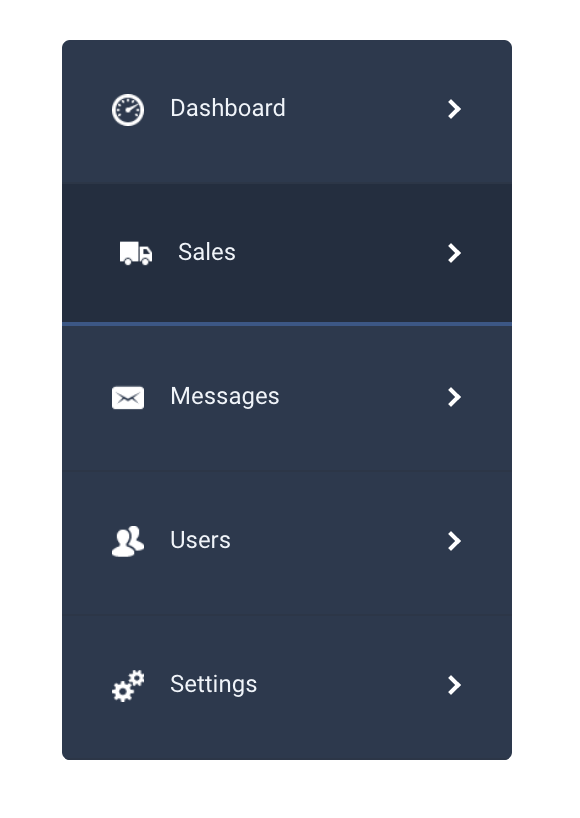
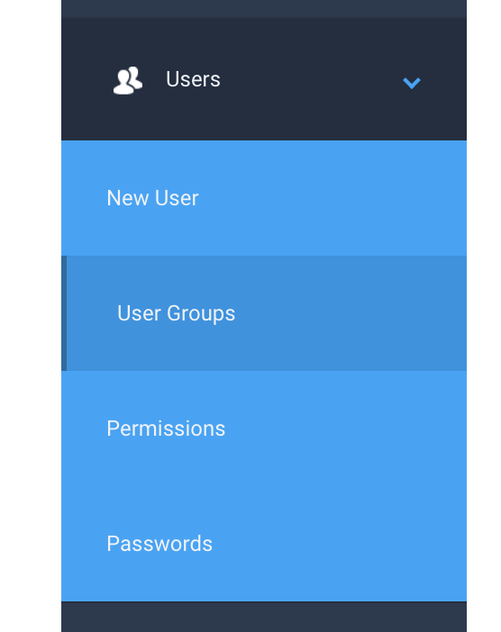
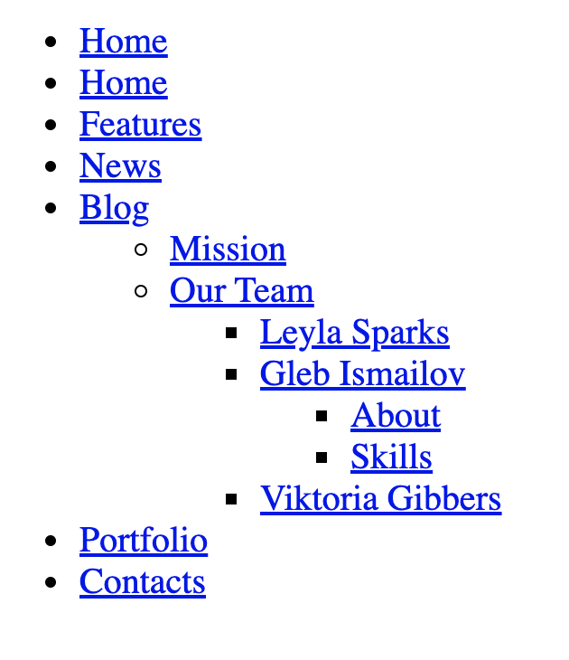
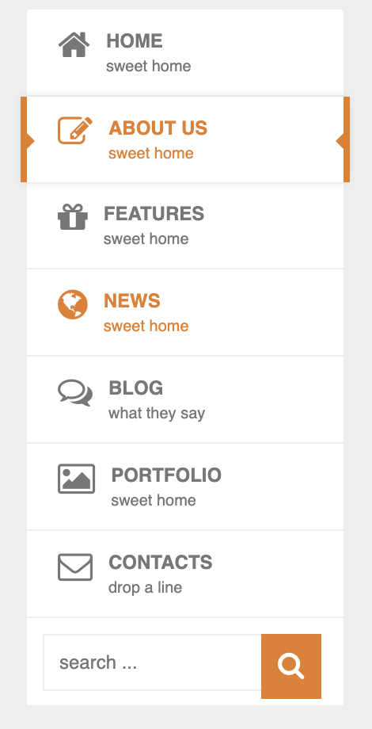
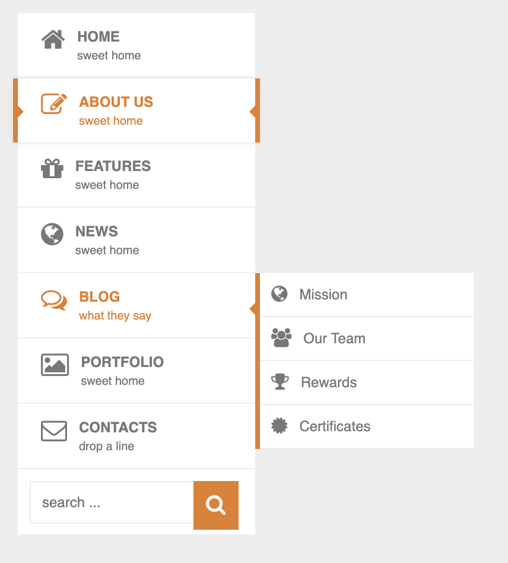
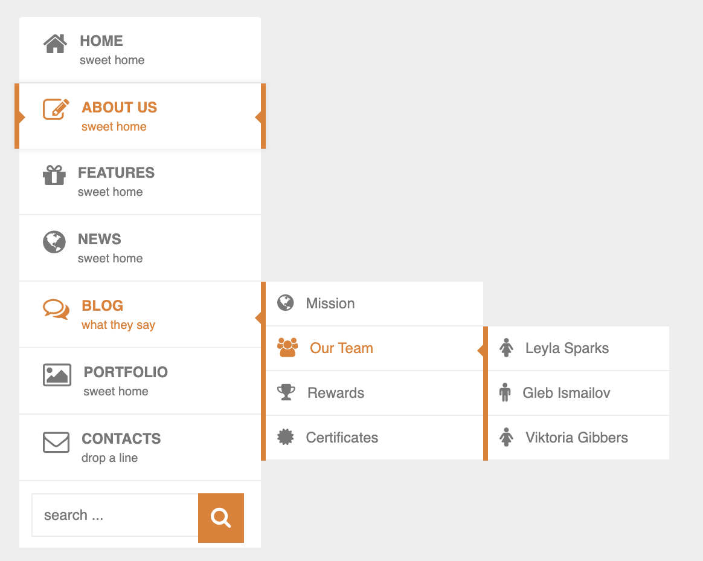

# Practice 01
- Let's create a menu that fixed 2 generation like this images at
```
./imgs/shallow-menu
```

## Menu structure


## `fold` mode (not hover to any item)


## `expand` mode (hove to an item), hover to `Dashboard`


## Hover to `Sales`


## Click to an item, (click to `Dashboard`) then all children of `Dashboard` will be show. Click again, all children will be hiden


## Click to `Users`


## Hover to child menu, EX hover to a item in `Users`:


## Note
- Don't use HTML, you need to use all js to draw menu
- See menu structure at `./menu/shallow.js`
- Try to add animation & effect

# Practice 02
- Let's create a dynamic menu like this image in this folder: `imgs/deep-menu`

## Menu structure


## `fold` mode (not hover to any item)


## hover to home


## hover to news


## hover to blog


## hover to blog, then hover to missions


## hover to blog, then hover to missions, then hover to our team


## hover to blog, then hover to missions, then hover to our team, then hover to any person you want


## Lưu ý
- Don't use HTML, you need to use all js to draw menu
- Item be hovered need in orange
- Each parent menu (generation 1) that is not active state (is not current page, `isActive = true`) that will be displayed like `ABOUT US`
- Try to add animation
- See menu structure at `./menu/deep.js`
- Try to add animation

# Practice 03
- Lets create a array that a timeline list
- After that, lets create a timeline using the array that you was created in previous step
- This is expected result
