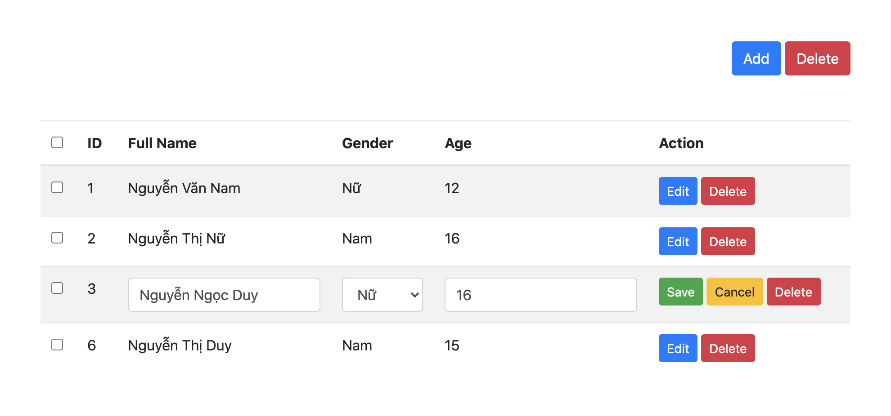
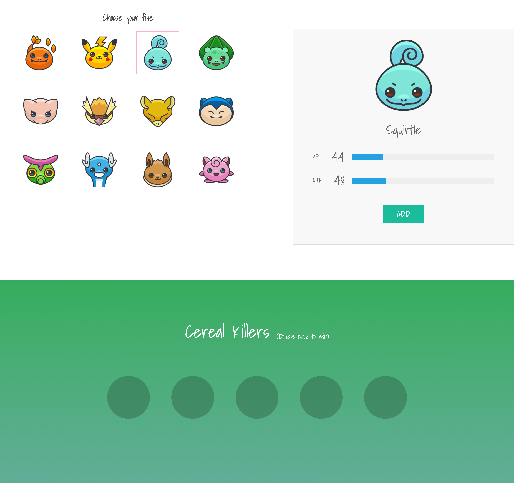
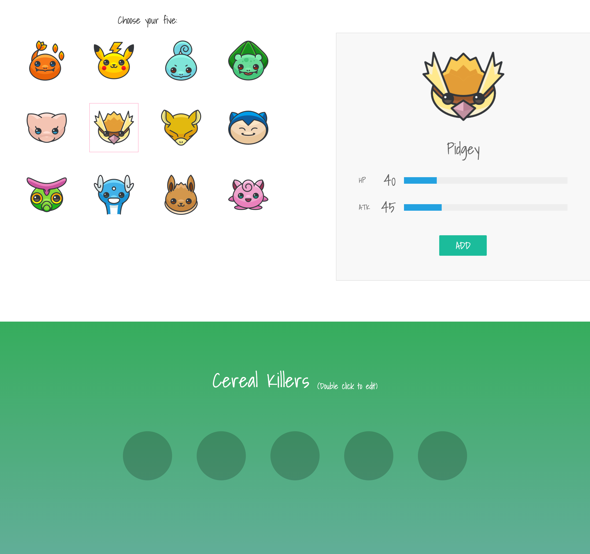
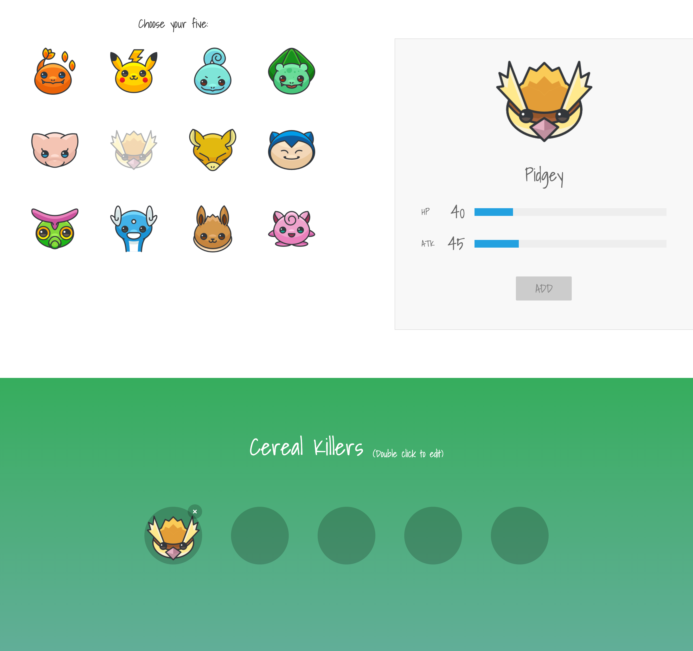
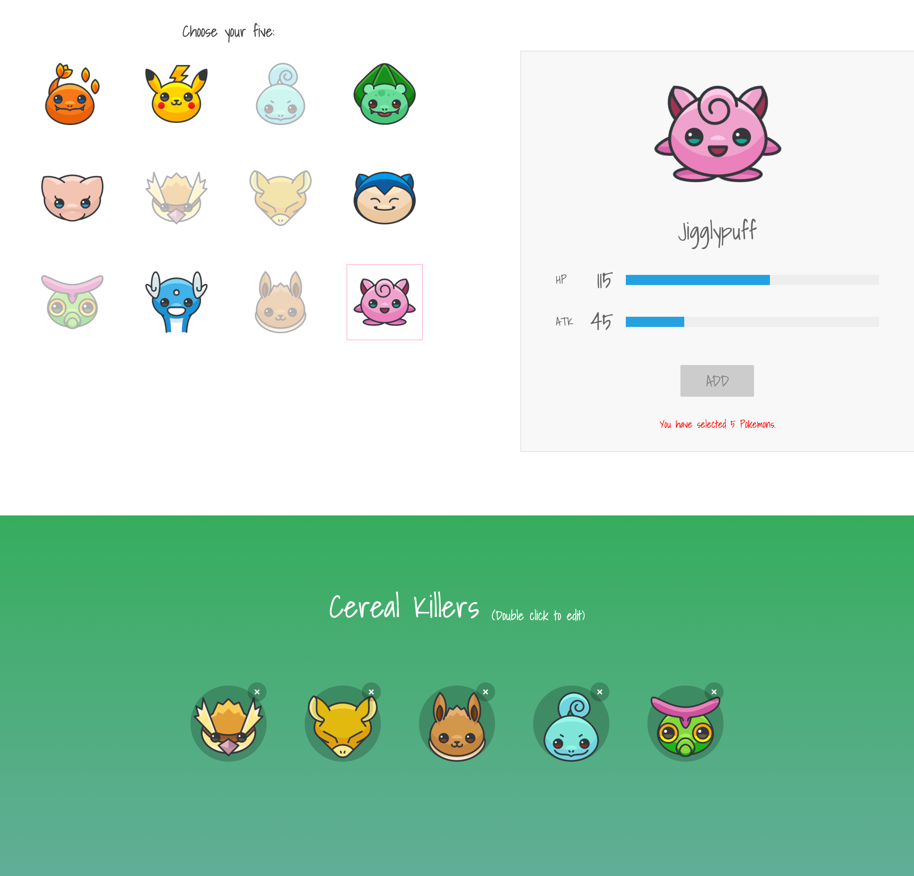
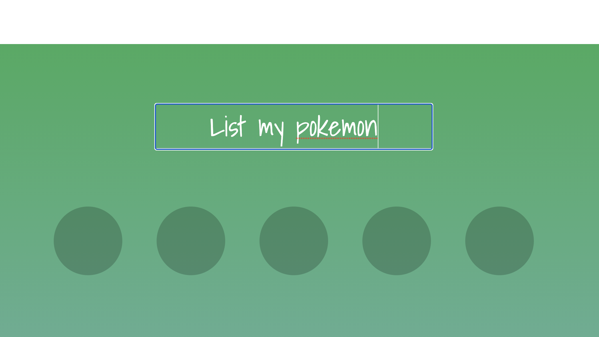

# Practice 01
- Lets use bootstrap 5 to create a table with all expected bellow:
- Table can `add`, `edit`, and `delete`, `select all`

## Table structure


When you click to `edit` button in each row, current row need switch to `edit` mode (show input, select, ...)
- The edit row is a row that have id is equal 3
- In edit mode, `edit` button is hidden, `save` and `cancel` button need to show. You can edit all fields except `id`
- When you click `save` button, current row need back to `read only mode` with new data, then hide `save` and `cancel` button, show `edit` button
- When you click `cancel`, current row need back to old data and back to `read only mode`
- When you click to `delete` in each row, current row need to removed
- When you click to `delete` button in the top of table, all selected row need to be removed
- When you click to `add` button, this table need add new row in the last of table with `edit` mode. You need to create new id to each row, the id need to unique

## Note
- Don't use HTML, you need to use all js to draw table

# Practice 02
- In a pokemon match, you just can pick maximum 5 pokemon
- Each pokemon have `HP` and `ATK` numeral that describe bellow

```javascript
const pokemons = [
    { id: 1, name: 'Charmander', hp: 39, atk: 52 },
    { id: 2, name: 'Pikachu', hp: 35, atk: 55 },
    { id: 3, name: 'Squirtle', hp: 44, atk: 48 },
    { id: 4, name: 'Bulbasaur', hp: 45, atk: 49 },

    { id: 5, name: 'Mew', hp: 100, atk: 100 },
    { id: 6, name: 'Pidgey', hp: 40, atk: 45 },
    { id: 7, name: 'Abra', hp: 25, atk: 20 },
    { id: 8, name: 'Snorlax', hp: 160, atk: 110 },

    { id: 9, name: 'Caterpie', hp: 45, atk: 30 },
    { id: 10, name: 'Dratini', hp: 41, atk: 64 },
    { id: 11, name: 'Eevee', hp: 55, atk: 55 },
    { id: 12, name: 'Jigglypuff', hp: 115, atk: 45 }
]
```

## illustration (picking Squirtle)


## illustration (picking Pidgey)


## After click add Pidgey

- Button `ADD` need to disable
- Cant pick Pidgey again, if you wanna pick Pidgey you need remove Pidgey first
- Pidgey's icon need to be blured

## When you pick pokemon 6th (maximum pokemon can be picked is 5)
Show this text: `You have selected 5 Pokemons.`


## When you click remove any pokemon that you was pick
- Pokemon will not blurred, you can add pokemon again
- Can remove any pokemon in picked list
- After you remove a pokemon, ex you remove 2nd in picked list, 3rd will be move to 2nd, 4th will be move to 3rd, 5th will be move to 4th

## When you double click to "Double click to edit"
- Switch to edit text mode:

- If you press enter, this display will show new text you was edit before

## Lets use this font to this practice
```css
@import url('https://fonts.googleapis.com/css?family=Roboto:300|Shadows+Into+Light');
```